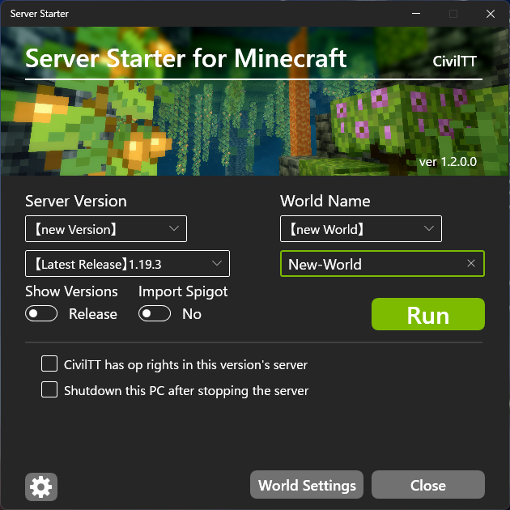

# 言語を選択(Select language)

  

    日本語
  

  

# Server Starter
ボタンクリックによって簡単にサーバーを立てることができるようにするソフトウェアです。

本ソフトの詳細な機能紹介は[公式サイト](https://civiltt.github.io/ServerStarter/)をご覧ください！

# 使い方

1. `Setup_ServerStarter.msi`を[こちら](https://github.com/CivilTT/ServerStarter/releases/latest/download/Setup_ServerStarter.msi)からダウンロード

1. ダウンロードしたファイルを起動し、デスクトップに`Server Starter`というショートカットが作成されたことを確認

    

1. `Server Starter`を起動

1. プレイヤー名を入力し，「チェック」を押したのちに利用規約に同意

    

1. 起動したいバージョンとワールド名を指定してサーバーを「実行」

    

1. 初回のサーバー起動時のみEulaへ同意

    

1. 少しするとサーバーの起動が完了．Let's Enjoy!!

    

# 注意事項

- ServerStarterではJavaの自動インストールはサポートされておりません．

    Javaがインストールされていない場合は以下のような案内が出ますので，指示に沿ってインストールしてください

    サーバーの起動にはJDK（Java Development Kit）が必要です

    

- サーバー終了時は必ず`stop`を黒いコンソール画面の中で入力し，**ウィンドウの「×ボタン」を押さないで下さい**

# 搭載機能（概要）

詳細な機能の使用方法については[公式サイト](https://civiltt.github.io/ServerStarter/)をご確認ください！

### ワールドのバージョンアップ（画像では1.16.1のワールドを1.19.3にバージョンアップ）

### Spigotの導入

### ワールドごとの各種設定（追加要素ではデータパックや配布ワールドの導入も可能）

### ShareWorld（複数人でサーバーを起動する場合のワールド同期機能）

### 自動ポート開放（ルーターのみ）

    
# 利用規約

インストーラに同梱されており、利用開始時にこれに同意する必要があります。

なお利用規約はバージョンの改定とともに、予告なく変更する可能性がありますこと、予めご了承ください。

# 問題が発生した場合

個別の環境における問題については、作者が回答することはありません。

しかし、明らかなシステム側のバグである場合やバグであることが疑われる場合は、恐れ入りますが作者の[TwitterのDM](https://twitter.com/CivilT_T)にそっとご報告いただけますと幸いです。

よろしくお願いいたします。

  

  

    English
  

  

# Server Starter

You can easily build the Minecraft Multiplay server

Do you want to more infomation about ServerStarter? Let's go to [official site](https://civiltt.github.io/ServerStarter/)!

# How to use

1. Download `Setup_ServerStarter.msi` at [here](https://github.com/CivilTT/ServerStarter/releases/latest/download/Setup_ServerStarter.msi)

1. Start this file and check to create `Server Starter` at your Desktop

    

1. Start `Server Starter`

1. Set your name in Minecraft and push "Check" button, then agree to terms of use

    

1. Set the server's version and world name as you like, then "RUN" your server

    

1. Agree eula

    

1. A few minites later, it completed the building server. Let's enjoy your Minecraft!

    

# Attentions
- This system doesn't support a silenct Java installation.

    If Java is not installed on your PC, you will get the following notice.

    You need JDK (Java Development Kit) to start a server.

    

- When you finish to play Minecraft, you have to type `stop` in server's black window.

    **DO NOT PUSH the "CLOSE BUTTON" in a window.**

# Features

Look at our [official site](https://civiltt.github.io/ServerStarter/) when you want to know about more details of ServerStarter!

### World's Version-up (In this figure, update the world 1.16.1 to 1.19.3)

### Import Spigot

### Setting for each worlds (In "Additionals" tab, you can install datapacks and cutom maps)

### ShareWorld (World synchronization system when multiple people start a server)

### Auto Port Mapping (Supported for an only router)

# Terms of Use

It is included with the installer and you must agree to it when you start using it.

Please note that the terms of use are subject to change without notice as the version is revised.

# TroubleShooting

The author does not answer questions in individual environments.

However, if it is an obvious system bug or suspected one, please kindly report it to the author's [Twitter DM](https://twitter.com/CivilT_T).

Thank you.

  

